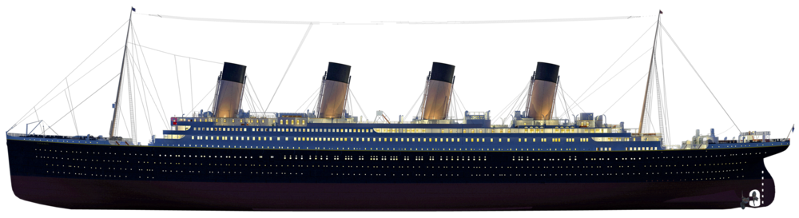

# Titanic Machine Learning from Disaster

Welcome to the Titanic -Machine Learning from Disaster! This project aims to analyze the Titanic dataset, a well-known dataset in the data science community, to predict whether a passenger survived the tragic sinking of the RMS Titanic in 1912. Our journey through this project will involve several key stages, from initial data exploration to the development and optimization of predictive models. This projects is perfect for beginners to become familiarized with the fundamental steps of a data science project. Let's embark on this analytical voyage together, uncovering insights and building a model to predict survival on the Titanic.

## Survival Prediction

At the heart of our project is the task of survival prediction. We aim to build a binary classification model that can accurately predict whether a passenger survived the Titanic disaster. This involves applying various machine learning techniques, including logistic regression, decision trees, random forests, support vector machines, and boosted tree methods. By leveraging these models, we seek to understand the factors that influenced survival rates and to develop a predictive framework that can generalize well to unseen data.

## Exploratory Data Analysis (EDA)

Before we dive into the predictive modeling, it is crucial to perform an exploratory data analysis (EDA). This stage will involve visualizing and statistically analyzing the dataset to gain insights into the distribution of key features, identifying correlations between variables, and uncovering patterns related to survival. Through EDA, we aim to develop a deeper understanding of the dataset, guiding our subsequent modeling efforts with informed decisions.

## Feature Engineering

A key component of our project is feature engineering, where we will create new features from the existing dataset to improve our model's predictive power. This could involve deriving titles from passenger names, creating new variables that represent family size by combining siblings/spouses and parents/children data, or extracting deck information from cabin numbers. Through innovative feature engineering, we aim to uncover hidden patterns and relationships that enhance our model's accuracy.

## Missing Value Imputation

The Titanic dataset is known for its missing values, especially in the age and cabin columns. Addressing these missing values through imputation techniques, such as using the median age or categorizing missing cabins, is essential for maintaining the integrity of our dataset. Proper handling of missing data is crucial for the performance of our predictive models, as it ensures that our analyses are based on a complete and accurate representation of the data.

## Model Comparison and Evaluation

After building our predictive models, we will embark on a comprehensive comparison and evaluation phase. Using metrics like accuracy, precision, recall, F1 score, and ROC-AUC, we will assess the performance of each model. This evaluation will help us understand which models are most effective at predicting survival on the Titanic and why, enabling us to select the best model for our project goals.

